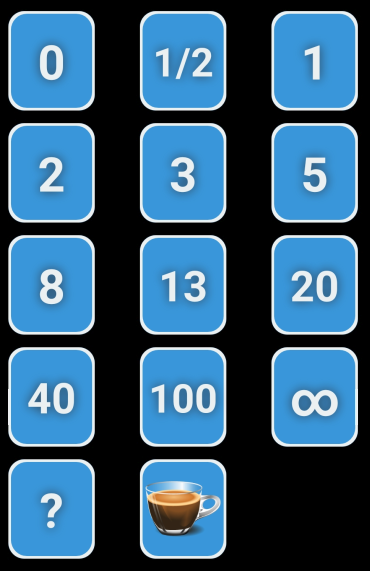

## **플래닝 포커란?**

**플래닝 포커**, 다른 말로 **스크럼 포커** 라고도 불리는데, 이는 추정을 위한 합의 기반 기술(consensus-based technique)로써 대부분 소프트웨어 개발에 있어서 개발 목표를 위한 공수 산정(일정 산정)이나 상대적 규모산정에 사용된다. 플래닝 포커에서 그 그룹의 구성원들은 공수 산정 시에 입으로 크게 말하는 대신에 숫자로된 카드를 테이블에 엎어놓는 방식으로 놀이처럼 진행한다. 그 카드들을 확인 하면서 해당 공수들이 논의된다. 숫자를 숨기는 이런 방식은 상대방의 예측에 관여하지 않고, 참석자의 의견을 객관적으로 들을 수 있게 만들어준다.

## **왜 사용하는가?**

플래닝 포커를 사용하는 이유는 다른 참가자의 영향을 배제하기 위해서이다. 만약 숫자를 말한다면, 그것은 곧 제안처럼 들리고, 그로인해 다른 참석자들의 공수산정에 영향을 미치기 때문이다. 플래닝 포커는 사람들이 독립적으로 사고하고 그 숫자를 동시에 제안하도록 해야 한다. 모든 사람들이 동시에 그들의 카드를 보여주어야만 가능하다.

## **플래닝 포커 방법**

**준비물**

- 해당 스프린트에서 개발을 진행할 User story backlog
- 플래닝 포커를 진행할 때 쓸 카드 or 웹/앱 시스템
    - [PlanningPoker.com - Estimates Made Easy. Sprints Made Simple.](https://www.planningpoker.com/)
    - scrum poker cards (agile)
    - [Agile Poker for Jira - planning & estimation | Atlassian Marketplace](https://marketplace.atlassian.com/apps/700473/agile-poker-for-jira-planning-estimation?hosting=datacenter&tab=overview&utm_source=google&utm_medium=cpc&utm_campaign=agile_poker_search&gclid=CjwKCAiAlrSPBhBaEiwAuLSDUMMdJfUqqrLyWgl8zO5wDyVcHmQY0SDg8ZcPzMlQEstz-g58npUYCxoCiTgQAvD_BwE)
    - scrum poker cards (agile)
    - 

**역할**

- 기획자(Product Owner): 요구 사항을 정의하는 사람
- 진행자: 플래닝 포커를 진행하는 사람
- 참석자: 실제 개발을 진행하는 사람

기획자가 먼저 사용자 스토리를 전체적으로 훝어가면서 설명한다. 이를 통해서 참석자들이 무엇을 개발할것인지 사용자 관점에서 이해를 하게 된다. 전체 그림을 이해하는 단계이다. 이때, 가급적이면 사용자 스토리는 사용자가 사용하는 시간순으로 나열되는 게 좋다.

예를 들어 다음과 같은 스토리가 있다고 하자

- 글쓰기
- 글목록보기
- 로그인

사용자 시나리오 순서는 사용자가 로그인 한후, 글 목록을 본 후에, 새로운 글을 글쓰기로 올린다. 라고 했을때 위의 백로그는 시간 순서에 맞지 않는다. 그래서 백로그를 정리하면 다음과 같이 정리가 되는게 좋다.

- 로그인
- 글목록보기
- 글쓰기

전체 컨택스트(문맥)을 이해했으면 각각의 스토리에 대해서 걸리는 시간을 Estimation(산정)한다.

하나의 스토리를 올리고, 기획자가 기능에 대해서 다시 설명을 한다. 참석자는 기능에 대해서 궁금한점이 있으면 기획자에게 물어보고 설명을 듣는다. 어느정도 기능이 이해가 되면 그 스토리에 대해서 참석자들이 구현에 걸릴 시간을 투표한다. 기간은 디자인, 구현과 “테스트”를 포함한 시간을 예측해서 투표한다.

이때 예측한 걸릴 시간은 모두 동시에 공개한다. 다같이 공개하기 전까지 자신이 예측한 시간을 다른 사람에게 절대 알리지 않는다. 먼저 공개하면 그쪽으로 자연스럽게 의견이 쏠리기 때문에 객관적인 일정 산정이 어렵다.

투표가 끝났으면 제일 낮은 점수와 제일 높은 점수의 사람으로부터 그렇게 점수를 준 이유를 설명을 듣는다.

낮은 점수를 준 사람은 빠른 해결책을 가지고 있을 수 있고, 반대로 높은 점수를 준 사람은 다른 사람이 놓치고 있는 것을 알고 있을 가능성이 많다. 충분히 의견을 듣고, 같은 스토리에 대해서 재투표를 진행한다.

이 과정은 합의가 이루어질 때까지 반복한다.

## **주의할 점**

- 수평적인 커뮤니케이션이 가능해야 한다
- 내가 구현하지 않는 부분에 대해 상대방에게 가혹하게 짧은 일정을 주지 않도록 한다
- 다른 사람의 의견에 밀려 객관적인 산정을 놓치지 않도록 한다

## **플래닝 포커 Q&A**

**Q. 점수의 기준 어떻게 되나요?**

A. 점수의 기준은 팀마다 다를 수 있습니다. 보통은 이상적인 작업시간(하루 8시간)을 기준으로 1점을 잡습니다. 즉, 다른 방해없이 집중해서 하루 8시간 작업에 투자하여 3일이 걸린다면 3점을 잡습니다. 중요한 점은 점수 기준에 대한 일관성을 확보해야 한다는 점입니다.

**Q. 도저히 합의에 이르지 못할 때는 어떤 방법이 있나요?**

A. 작업이 너무 애매해서 점수합의가 어려울 경우 지금까지 추정한 카드를 점수별로 분류하여 추정하려는 작업이 어느 작업과 가장 유사한 규모인지 비교해 보고 비슷한 작업의 점수로 결정합니다. 이를 삼각측량이라고 합니다. 1, 2 점으로 너무 논쟁하지 마세요. 추정은 반복적이며 앞으로 재추정할 수 있는 기회는 많이 있습니다. 겨우 1, 2 점입니다.

**Q. 플래닝 포커 숫자는 무슨 의미인가요?**

플래닝 포커에선 1, 2, 3, 5, 8… 의 피보나치 숫자를 사용합니다. 피보나치 수열은 앞의 두 숫자의 합이 그 다음에 오는 숫자가 되는 수열인데요, 피보나치 수열을 사용하는 이유는 피보나치 수열 자체가 불확실성을 포함한 수열이기 때문입니다. 피보나치 수열은 처음엔 앞 숫자와의 간격이 크지 않지만, 뒤로 갈수록 점점 앞 수와의 간격이 커집니다.

> 1, 2, 3, 5, 8, 13, 21, … : 1에서 3까지는 앞 수와의 차이가 1밖에 되지 않지만 3부터는 앞 수와의 차이가 점점 커짐

이는 큰 스토리 포인트를 할당한 사용자 스토리에는 예측하기 어려운 여러 가지 변수가 있다는 것을 간접적으로 나타냅니다. 또한 피보나치 숫자를 사용하면 일정 산정의 정확성을 높입니다. 피보나치 수열이 아닌 일반 자연수를 늘어놓은 등차수열을 사용하면 6, 7, 8, 9, 10 등 다양한 값이 나올 수 있을 것입니다. 하지만 피보나치 수열을 사용한다면 5나 8, 13, 이 세 가지 수 중 하나로 수렴할 확률이 높고, 해당 수열 간격이 큰 만큼 불확실성을 포함하고 있다고 쉽게 파악할 수 있습니다.

## **참고**

- [플래닝 포커](https://ko.wikipedia.org/wiki/%ED%94%8C%EB%9E%98%EB%8B%9D_%ED%8F%AC%EC%BB%A4)
- [플래닝 포커를 이용한 프로젝트 일정 산정](https://bcho.tistory.com/1041)
- [PlanningPoker.com - Estimates Made Easy. Sprints Made Simple.](https://www.planningpoker.com/)
- [포커, 어디까지 쳐봤니 – 서비스 개발에 플래닝 포커 도입 사례](https://tech.kakao.com/2020/09/08/planning-poker/)
- [플래닝 포커](https://ko.wikipedia.org/wiki/%ED%94%8C%EB%9E%98%EB%8B%9D_%ED%8F%AC%EC%BB%A4)
- [Introducing Agile Poker for Jira](https://youtu.be/Qn7Q-C5XYpU)
- [Planning poker with planningpoker.com](https://youtu.be/LERjCWWlgGc)
- [실전! 플래닝 포커](https://greatkim91.tistory.com/178)
- [사용자 스토리 포인트로 스마트하게 프로젝트 진행하기(feat. LINE Pay 개발 팀)](https://engineering.linecorp.com/ko/blog/user-story-point-in-line-pay-team/)